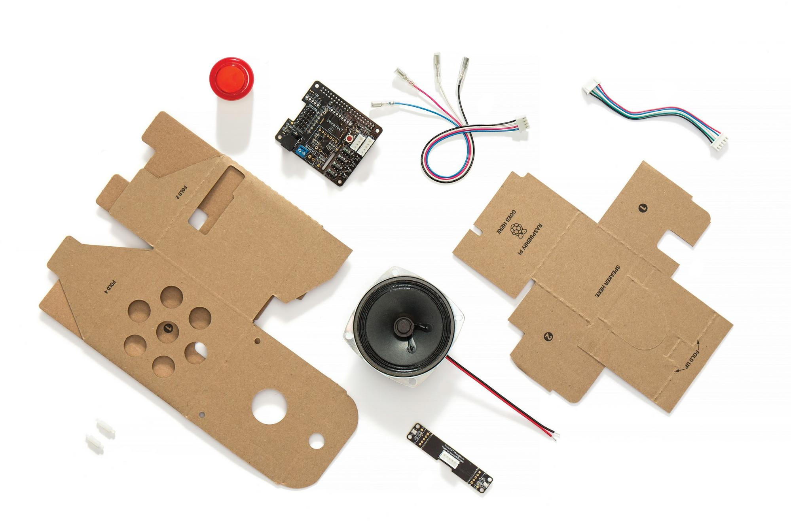

# Scout — A Voice Assistant I Built on a Raspberry Pi

> An always-listening, AI-powered voice assistant that runs on a $50 Raspberry Pi
> and helps a high-school student discover research, internships, competitions,
> and scholarships — by voice, hands-free, in real time.

<p>
  
  
  
  
  
</p>

Scout takes a retired **Google AIY Voice Kit V1** — a cardboard Raspberry Pi
speaker kit whose original Google Assistant software was shut down — and brings it
back to life with a modern, cloud-AI pipeline I designed and wrote from scratch.

Press the button (or say a wake word), ask a question out loud, and Scout
verifies it's really me speaking, transcribes my speech in the cloud, reasons
with Google Gemini, searches the live web when it needs current facts, saves good
opportunities to a Google Sheet, and **speaks the answer back one sentence at a
time** so it starts replying before it has finished thinking.

---

## 🔧 The starting point: a kit that no longer worked

<p align="center">
  
  <br>
  <em>What I started with — the AIY Voice Kit V1: folded cardboard panels, a
  speaker, an arcade button, the Voice HAT board, a mic daughterboard, and a
  handful of cables.</em>
</p>

This is the whole kit, fresh out of the box. Google sold it in 2017 with exactly
one purpose: a guided, follow-the-instructions demo of **Google Assistant**.

There was a catch. The kit's software depended on Google's Assistant SDK, which
**Google has since retired** — its apt repository now 404s and the library it
relied on is gone. Follow the original instructions today and you hit a dead end:
the cloud service it talked to no longer exists. The kit had become, effectively,
a cardboard box of e-waste.

So I rebuilt it — not the cardboard, the brain. Rather than try to restore what it
used to do, I wrote an entirely new software stack that makes this hardware do far
more than Google ever shipped:

| The kit as designed (2017) | What I turned it into |
|---|---|
| One hardcoded skill: talk to Google Assistant | A general assistant powered by Google Gemini with live tool use |
| Cloud dependency now shut down — won't run at all | Runs today on modern 64-bit Raspberry Pi OS |
| Anyone could talk to it | Speaker verification — answers only its owner |
| No memory between questions | Persistent, multi-conversation memory |
| Couldn't act on the world | Searches the live web and saves opportunities to Google Sheets |
| Robotic, canned text-to-speech | Streaming neural TTS that replies as it thinks |

None of this came from a tutorial — the tutorial's finish line was removed. Every
piece of the pipeline in this repo is something I designed, wrote, and debugged on
real hardware to bring a discontinued device back to life as something genuinely
useful.

---

## 🎬 Demo

> _Add a short clip or photo of the device here — e.g. `docs/demo.gif` or a
> link to a 30-second YouTube demo. A real recording of the button → answer
> loop is the single most convincing thing on this page._

```
$ python main.py
Piper TTS loaded: en_US-lessac-low.onnx
Idle. Press the button to talk. Ctrl+C to quit.

[button] Listening...
[transcribe 2.1s]
You said: Find aerospace research programs for high school sophomores in Texas.
[respond 3.4s, first chunk 1.2s]
Scout: The Texas A&M Aerospace summer research camp accepts sophomores...
```

---

## ✨ What it does

- **Hands-free Q&A by voice** — button or optional "Hello Claude" wake word, a
  spoken greeting, then natural-language questions and spoken answers.
- **Speaker verification** — a voiceprint check means Scout only answers its
  owner, and politely refuses anyone else.
- **Live web search** — Gemini calls a Google-Search-grounded tool for anything
  time-sensitive (deadlines, openings, prices) instead of guessing from stale
  training data, and names its sources out loud.
- **Saves opportunities to Google Sheets** — "save that one" appends the program,
  deadline, eligibility, and a link to a spreadsheet via the Sheets API.
- **Conversational memory** — every chat is stored as JSON; you can ask Scout to
  list past conversations, continue an old one, or start fresh.
- **Voice-controlled volume** — "turn it up," "set volume to 70 percent."
- **Free-tier aware** — tracks daily API usage locally and warns before the free
  quota runs out, so it never silently dies mid-conversation.

---

## 🏗️ Architecture

Scout is a small **event loop** that wires together five subsystems — audio
capture, speaker ID, speech-to-text, an LLM reasoning layer with tools, and
neural text-to-speech — each isolated in its own module.


**Why it's built this way:**

- The reasoning layer uses **manual function-calling** so the Pi stays in control
  of every side effect (web search, saving to Sheets, switching chats, volume).
- `web_search` is itself a function tool whose handler makes a *separate*,
  grounding-only Gemini call. This sidesteps a real API constraint — Gemini can't
  combine built-in Search grounding with custom function tools in one request —
  so each call uses *either* grounding *or* tools, never both, and search only
  runs when the model actually asks for it (which conserves the free quota).
- The answer is **streamed and spoken sentence-by-sentence on a background
  thread**, so synthesis and playback of the first sentence overlap generation of
  the rest. Audio starts ~1 second after the model replies instead of after the
  whole answer is synthesized.

---

## 🔁 How one question flows

1. **Trigger** — a background thread watches the physical button; an optional
   Porcupine wake word can trigger hands-free.
2. **Capture** — PvRecorder streams mic frames; a simple RMS energy threshold
   detects when I start and stop talking (endpointing), with a rolling
   pre-buffer so the first word isn't clipped.
3. **Verify** — Resemblyzer turns the clip into a voice embedding and compares it
   (cosine similarity) to my enrolled voiceprint. No match → refuse.
4. **Transcribe** — the clip is packed into an in-memory WAV and sent to Gemini
   for cloud speech-to-text (replacing on-device Whisper, which was far too slow
   on a Pi 3B).
5. **Reason** — the transcript plus chat history go to Gemini with a personalized
   system prompt and four function tools. A bounded tool loop runs any calls.
6. **Search (if needed)** — a grounded Gemini call fetches live facts and source
   titles, which the model weaves into its answer.
7. **Speak** — the answer streams back as sentences; each is cleaned of markdown,
   volume-adjusted, synthesized by Piper, and played on the Voice HAT.

---

## 🧰 Tech stack

| Layer | Choice | Notes |
|---|---|---|
| **Language** | Python 3.13 | Standard-library-first; small, readable modules. |
| **AI / reasoning** | Google **Gemini** (`google-genai` SDK) | Model is configurable via `SCOUT_MODEL`; default `gemini-3.1-flash-lite`. |
| **Speech-to-text** | Gemini cloud STT | Audio sent as an inline WAV part; ~2 s vs ~30 s for local Whisper. |
| **Text-to-speech** | **Piper** neural TTS | ONNX voice model running on ARM CPU; streamed per sentence. |
| **Speaker ID** | **Resemblyzer** | Voice embedding + cosine-similarity threshold. |
| **Wake word** | **Porcupine** (optional) | Auto-enables when a key + keyword file are present; button works either way. |
| **Mic capture** | **PvRecorder** | One library owns the mic for both idle and capture. |
| **Integrations** | Google Sheets API, Google Search grounding | OAuth desktop credentials; secrets kept out of source. |
| **Hardware** | Raspberry Pi 3B + AIY Voice HAT | 1 GB RAM, quad-core ARM, single mic + speaker. |

---

## 📁 Project structure

| File | Responsibility |
|---|---|
| [`main.py`](main.py) | The event loop: LEDs, greeting, capture, the speak-as-you-stream TTS worker, error/rate-limit handling. |
| [`assistant.py`](assistant.py) | Gemini integration — cloud STT, the streaming tool loop, grounded `web_search`, and all tool definitions. |
| [`listener.py`](listener.py) | Mic ownership, optional wake word, and RMS-based end-of-speech detection. |
| [`voice_id.py`](voice_id.py) | Resemblyzer speaker verification against the enrolled voiceprint. |
| [`chats.py`](chats.py) | JSON conversation memory (list / load / continue / new). |
| [`google_sync.py`](google_sync.py) · [`google_auth.py`](google_auth.py) | Saving opportunities to Google Sheets. |
| [`usage.py`](usage.py) | Local daily request counter + free-tier warnings. |
| [`volume.py`](volume.py) | Voice-controlled software volume gain, persisted to disk. |
| [`config.py`](config.py) | One place for every setting; almost all overridable by env var. |
| [`enroll.py`](enroll.py) | One-time owner voiceprint enrollment. |
| [`system_prompt.txt`](system_prompt.txt) | Scout's personality and rules — editable without touching code. |

---

## 🧗 Engineering challenges I solved

This kit is discontinued hardware running on a modern OS, so a lot of the work was
making old assumptions meet new reality. A few highlights:

- **30-second latency → ~2 seconds.** On-device Whisper took ~30 s per question
  and ate the Pi's 1 GB of RAM. I moved speech-to-text to a cloud Gemini call and
  freed the memory entirely.
- **Answers that start instantly.** Even a fast model feels slow if you wait for a
  whole paragraph to synthesize. I stream the model's response and feed complete
  sentences to a background TTS worker, so the first sentence plays while the rest
  is still being generated.
- **A real API constraint.** Gemini can't mix built-in Search grounding with
  custom function tools in a single request. I made `web_search` a function tool
  that internally fires a separate grounding-only call — keeping all my tools
  *and* live search, without ever violating the constraint.
- **Rate limits that lied.** Google returns the *same* `429` message for both
  per-minute and per-day limits. An early version mis-read a temporary
  per-minute limit as "out of credits for the day" and locked itself out. I
  rewrote the handler to fail soft and never falsely block.
- **Fitting on a Pi 3B.** PyTorch (~426 MB) overflowed the Pi's 453 MB `/tmp`
  during install; I worked around it with cache/`TMPDIR` redirection. Dropped a
  hard `numpy<2` pin that had no Python 3.13 wheel.
- **Reviving dead hardware.** The official AIY apt repo is gone (404), so the
  board library is built from GitHub source; the Voice HAT soundcard is enabled
  by hand in `config.txt`; everything runs in a venv to satisfy PEP 668.
- **Graceful degradation.** TTS falls back Piper → pico2wave → espeak; the wake
  word silently disables to button-only if no key is present; a missing voiceprint
  warns instead of crashing. The assistant tries hard never to die mid-sentence.

---

## 🔒 Security & privacy

- **No secrets in the repo.** The Gemini API key is read from an environment
  variable; Google OAuth credentials/tokens and the personal voiceprint are all
  git-ignored.
- On the device, secrets live in `/etc/scout.env` (`chmod 600`) and are loaded by
  the systemd service via `EnvironmentFile=`.
- Speaker verification means the device won't answer strangers.
- The system prompt includes child-safety guidance (the end user is a minor):
  flag scams, never repeat sensitive personal data, and suggest looping in an
  adult for anything involving money or signups.

---

## 🚀 Running it yourself

> Built for an assembled AIY Voice Kit V1 on 64-bit Raspberry Pi OS. Full setup
> notes (systemd service, hardware config, OAuth) are inline in the code and
> config; the short version:

```bash
# 1. Create a virtualenv (PEP 668 blocks global pip on modern Pi OS)
python3 -m venv ~/aiy_env && source ~/aiy_env/bin/activate

# 2. Install dependencies
pip install --no-cache-dir -r requirements.txt

# 3. Add your key (kept out of source control)
echo 'GEMINI_API_KEY=AIza...your-key' | sudo tee /etc/scout.env >/dev/null
echo 'SCOUT_MODEL=gemini-3.1-flash-lite' | sudo tee -a /etc/scout.env >/dev/null
sudo chmod 600 /etc/scout.env

# 4. Enroll your voice (one time)
python enroll.py

# 5. Run
set -a && source /etc/scout.env && set +a
python main.py
```

A `scout.service` systemd unit (using the venv's Python and the `/etc/scout.env`
file) makes it start on boot.

### Configuration

Almost everything is tunable via environment variables — model, daily quota,
energy threshold, speaker strictness, TTS voice, playback device, volume limits.
See [`config.py`](config.py) for the full list.

---

## 🗺️ Roadmap

- [ ] Record a real demo video / add device photos.
- [ ] Re-enable the "Hello Claude" wake word (needs a Picovoice keyword file).
- [ ] Cut transcription latency further (streaming or on-device STT).
- [ ] A small web dashboard for saved opportunities.
- [ ] Package the systemd unit + first-run setup into one script.

---

## 🎓 What I learned

Building Scout end-to-end meant owning the whole stack: real-time audio capture
and endpointing, speaker recognition with embeddings, integrating a multimodal
LLM with tool use and live web grounding, designing for hard memory/CPU limits,
handling flaky networks and ambiguous API errors gracefully, keeping secrets out
of source control, and shipping it as a service that survives reboots. It started
as a dead cardboard speaker and became a system I actually use.

---

## 📄 License

Released under the MIT License — feel free to learn from it. Add a `LICENSE` file
with your name to make it official.
