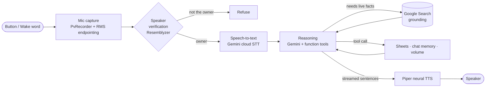

# Scout — Raspberry Pi Voice Assistant

Scout is a voice assistant I built on a Google AIY Voice Kit (Raspberry Pi 3B and
the Voice HAT board). The kit was originally a Google Assistant demo, but that
service was shut down, so I wrote my own software for it instead.

You press the button (or say a wake word), ask a question out loud, and Scout
checks that I'm the one speaking, transcribes the question, answers it with Google
Gemini, searches the web when it needs current facts, and reads the answer back.
It can also save things to a Google Sheet and remember past conversations.

<p>
  
  
  
</p>

## The starting point

<p align="center">
  
  <br>
  <em>The AIY Voice Kit V1 as it ships: cardboard panels, a speaker, a button, the
  Voice HAT board, a mic board, and some cables.</em>
</p>

The photo above is the whole kit out of the box. Google sold it in 2017 to run one
thing: a guided Google Assistant demo. That demo depended on Google's Assistant
SDK, which has since been discontinued. The apt repository it used now returns a
404 and the library it imported is gone, so the original instructions no longer
work.

I kept the hardware and replaced the software. The table below is what changed.

| Original kit (2017) | What I built |
|---|---|
| One use: talk to Google Assistant | A general assistant on Google Gemini with tool use |
| Cloud dependency shut down, won't run | Runs on current 64-bit Raspberry Pi OS |
| Anyone could use it | Speaker verification, so it only answers me |
| No memory between questions | Saved, multi-conversation memory |
| Couldn't take actions | Web search and saving results to Google Sheets |
| Canned text-to-speech | Streaming neural text-to-speech |

## What it does

- Button or optional wake word, a spoken greeting, then spoken answers.
- Speaker verification. It checks a voiceprint and refuses anyone who isn't the
  owner.
- Live web search. Gemini calls a search-grounded tool for time-sensitive things
  like deadlines and openings, and names its sources out loud.
- Saves opportunities to a Google Sheet through the Sheets API.
- Conversation memory. Chats are stored as JSON, and you can list past ones,
  continue an old one, or start fresh.
- Voice-controlled volume.
- Tracks daily API usage and warns before the free quota runs out.

## Architecture

Scout is an event loop that connects five parts: audio capture, speaker ID,
speech-to-text, a reasoning layer with tools, and text-to-speech. Each part is its
own module.



A few design notes:

- The reasoning layer uses manual function-calling, so the Pi runs every side
  effect itself: web search, saving to Sheets, switching chats, and volume.
- `web_search` is a function tool whose handler makes a separate, search-grounded
  Gemini call. This is a workaround for a real limit: Gemini can't combine
  built-in Search grounding and custom function tools in one request. So each call
  uses one or the other, and search only runs when the model asks for it, which
  saves quota.
- The answer is streamed and spoken one sentence at a time on a background thread.
  The first sentence plays while the rest is still being generated, so audio
  starts about a second after the model replies instead of after the whole answer
  is synthesized.

## How one question flows

1. A background thread watches the button. An optional Porcupine wake word can
   trigger it hands-free.
2. PvRecorder streams mic frames. An RMS energy threshold detects when I start and
   stop talking, with a short pre-buffer so the first word isn't cut off.
3. Resemblyzer turns the clip into a voice embedding and compares it to my saved
   voiceprint with cosine similarity. No match means it refuses.
4. The clip is packed into an in-memory WAV and sent to Gemini for speech-to-text.
5. The transcript plus chat history go to Gemini with a system prompt and four
   function tools. A bounded loop runs any tool calls.
6. If a search is needed, a grounded Gemini call returns live facts and source
   titles for the model to use.
7. The answer streams back as sentences. Each one is cleaned of markdown, volume
   adjusted, synthesized by Piper, and played on the Voice HAT.

## Tech stack

| Layer | Choice | Notes |
|---|---|---|
| Language | Python 3.13 | Standard library where possible, small modules. |
| Reasoning | Google Gemini (`google-genai` SDK) | Model set by `SCOUT_MODEL`, default `gemini-3.1-flash-lite`. |
| Speech-to-text | Gemini cloud STT | Audio sent as an inline WAV part. About 2s, versus ~30s for local Whisper. |
| Text-to-speech | Piper | ONNX neural voice on ARM CPU, streamed per sentence. |
| Speaker ID | Resemblyzer | Voice embedding plus a cosine-similarity threshold. |
| Wake word | Porcupine (optional) | Turns on when a key and keyword file are present. Button works either way. |
| Mic capture | PvRecorder | One library owns the mic for idle and capture. |
| Integrations | Google Sheets API, Search grounding | OAuth desktop credentials, kept out of the source. |
| Hardware | Raspberry Pi 3B, AIY Voice HAT | 1 GB RAM, quad-core ARM, one mic and one speaker. |

## Project structure

| File | Job |
|---|---|
| [`main.py`](main.py) | The event loop: LEDs, greeting, capture, the speak-as-you-stream TTS worker, error and rate-limit handling. |
| [`assistant.py`](assistant.py) | Gemini code: cloud STT, the streaming tool loop, grounded `web_search`, and the tool definitions. |
| [`listener.py`](listener.py) | Mic handling, optional wake word, and RMS end-of-speech detection. |
| [`voice_id.py`](voice_id.py) | Speaker verification against the saved voiceprint. |
| [`chats.py`](chats.py) | JSON conversation memory: list, load, continue, new. |
| [`google_sync.py`](google_sync.py) and [`google_auth.py`](google_auth.py) | Saving to Google Sheets. |
| [`usage.py`](usage.py) | Daily request counter and free-tier warnings. |
| [`volume.py`](volume.py) | Voice-controlled volume, saved to disk. |
| [`config.py`](config.py) | All settings, most overridable by environment variable. |
| [`enroll.py`](enroll.py) | One-time voiceprint enrollment. |
| [`system_prompt.txt`](system_prompt.txt) | The assistant's rules, editable without touching code. |

## Problems I ran into

The kit is discontinued hardware on a current OS, so a lot of the work was making
old assumptions line up with new reality.

- Latency. On-device Whisper took about 30 seconds per question and used most of
  the Pi's 1 GB of RAM. I moved speech-to-text to a Gemini call, which dropped it
  to a couple of seconds and freed the memory.
- Slow-feeling answers. Even a fast model feels slow if you wait for a whole
  paragraph to synthesize. I stream the response and hand finished sentences to a
  background TTS thread, so the first sentence plays while the rest generates.
- API limits. Gemini can't mix built-in Search grounding and custom function tools
  in one request. I made `web_search` a function tool that fires a separate
  grounding-only call, which keeps both features without breaking that rule.
- Rate-limit handling. Google returns the same 429 message for per-minute and
  per-day limits. An early version read a temporary per-minute limit as "out for
  the day" and locked itself out, so I rewrote the handler to fail soft.
- Install constraints. PyTorch is about 426 MB and overflowed the Pi's 453 MB
  `/tmp` during install, so I redirected the cache and temp dir. I also dropped a
  `numpy<2` pin that had no Python 3.13 wheel.
- Reviving the board. The official AIY apt repo is gone, so the board library is
  built from GitHub source. The Voice HAT soundcard is enabled by hand in
  `config.txt`, and everything runs in a venv to satisfy PEP 668.
- Fallbacks. TTS falls back from Piper to pico2wave to espeak, the wake word
  disables itself to button-only if there's no key, and a missing voiceprint warns
  instead of crashing.

## Security

- The Gemini API key is read from an environment variable, never hardcoded.
- Google OAuth credentials and tokens, the voiceprint, and saved conversations are
  all in `.gitignore` and never committed.
- On the device, secrets live in `/etc/scout.env` (`chmod 600`) and are loaded by
  the systemd service through `EnvironmentFile=`.
- Speaker verification means the device won't answer people other than the owner.

## Running it

Built for an assembled AIY Voice Kit V1 on 64-bit Raspberry Pi OS. The short
version:

```bash
# 1. Virtualenv (PEP 668 blocks global pip on current Pi OS)
python3 -m venv ~/aiy_env && source ~/aiy_env/bin/activate

# 2. Dependencies
pip install --no-cache-dir -r requirements.txt

# 3. API key, kept out of source control
echo 'GEMINI_API_KEY=AIza...your-key' | sudo tee /etc/scout.env >/dev/null
echo 'SCOUT_MODEL=gemini-3.1-flash-lite' | sudo tee -a /etc/scout.env >/dev/null
sudo chmod 600 /etc/scout.env

# 4. Enroll your voice (one time)
python enroll.py

# 5. Run
set -a && source /etc/scout.env && set +a
python main.py
```

A systemd unit using the venv's Python and the `/etc/scout.env` file makes it
start on boot.

Most settings are environment variables: model, daily quota, energy threshold,
speaker strictness, TTS voice, playback device, and volume limits. See
[`config.py`](config.py) for the full list.

## To do

- Re-enable the wake word (needs a Picovoice keyword file).
- Cut transcription latency further.

## License

MIT.
